# Machine Learning Engineer Nanodegree

## Architectural Picture Classification
Wan Li  
May 25, 2018

## I. Definition

### Project Overview
This project is aimed to analyze a picture of a building in terms of the style of buildings and the composition of the photo.  
Though photos and renderings of buildings may have infinite possibilities, many of they can be classified into a limited number of popular types according to the composition, style of buildings, etc.    
I would roughly classify exterior pictures of (mid-rise to high rise) buildings into a few categories according to the scene, point of view, including street view, far away view, mid-air view, top view and look up view. There are usually other objects like people, cars, boats and animals in the picture, which I will also identify.  
Judging the style of architecture is kind of subjective without very concrete standards now, and a person need to learn a lot about architectural history and current famous architects to tell the possible style of a building. I want to design an algorithm to identify the possible style of building in a photo or rendering. For this project, I just focus on about 10 common architectural styles.  
Based on this project, later I want to develop a project to help generate pictures of buildings based on input, view, objects and architectural style.
### Relevant Research
There are some existing researches about classifying architectural styles and scenes. Many of them are about classifying traditional styles and scenes:  
[Classification of Architectural Heritage Images Using Deep Learning Techniques]( https://www.researchgate.net/publication/320052364_Classification_of_Architectural_Heritage_Images_Using_Deep_Learning_Techniques)  
[Classifying U.S. Houses by Architectural Style Using Convolutional Neural Networks](http://cs231n.stanford.edu/reports/2017/pdfs/126.pdf)  
[Automatic Architectural Style Recognition](https://www.int-arch-photogramm-remote-sens-spatial-inf-sci.net/XXXVIII-5-W16/171/2011/isprsarchives-XXXVIII-5-W16-171-2011.pdf)  
[Training an Architectural Classifier](https://hackernoon.com/training-an-architectural-classifier-5f1b4f512368)  
[Research on Classification of Architectural Style Image Based on Convolutional Neural Network](https://ieeexplore.ieee.org/document/8122517/metrics?part=1)

### Problem Statement
Given a picture of a building, I want the algorithm to tell the view of the picture, the obvious objects like people and cars and the most possible style of the building. The view will be among a few classes I defined and the style will be among 10 styles that I choose for the project. The obvious objects will give a name of the object and its coordinates.
This is an image recognition and classification problem. These problems should be solved by machine learning algorithms such as SVM, CNN, etc.   
This report will focus on the architecture style classification.

### Metrics
I would use accuracy rate and a confusion matrix as evaluation metrics to evaluate the machine learning classification performance. Accuracy rate is the rate of correct predictions. Confusion matrix will give detailed information about the classification predictions.
For this project, I will simply use the YOLO system as it is without training or evaluating the model statistically because the dataset is not labeled in terms of objects. I will test it with a few test cases.

## II. Analysis

### Data Exploration

I would mainly use two data sets for this project: arc_scene and arc_style. The dataset arc_scene includes about 1000 pictures of buildings labeled according to its scene. The dataset arc_style includes 2000 pictures of buildings labeled according to its architectural style. I selected 12 styles that are far from inclusive, but they are very distinguishable and common in the architectural design industry. Each style has around 100 or 200 images.  
Unlike traditional buildings, there is no clear criterion for classification of modern architecture. So I defined some styles based on knowledge of architecture. There are well known traditional architectural styles and the modern styles are mostly based on the work of a famous architecture with strong features.
All the pictures have been manually collected from Google Images, Pinterest, Baidu Images and other websites and labeled by myself. These labeled pictures will be used as input for machine learning for classification.  
The images have varying sizes bigger than 300*300, and will be resized as 300*300 when loaded.

### Exploratory Visualization

12 Architecture Styles in the Project:  
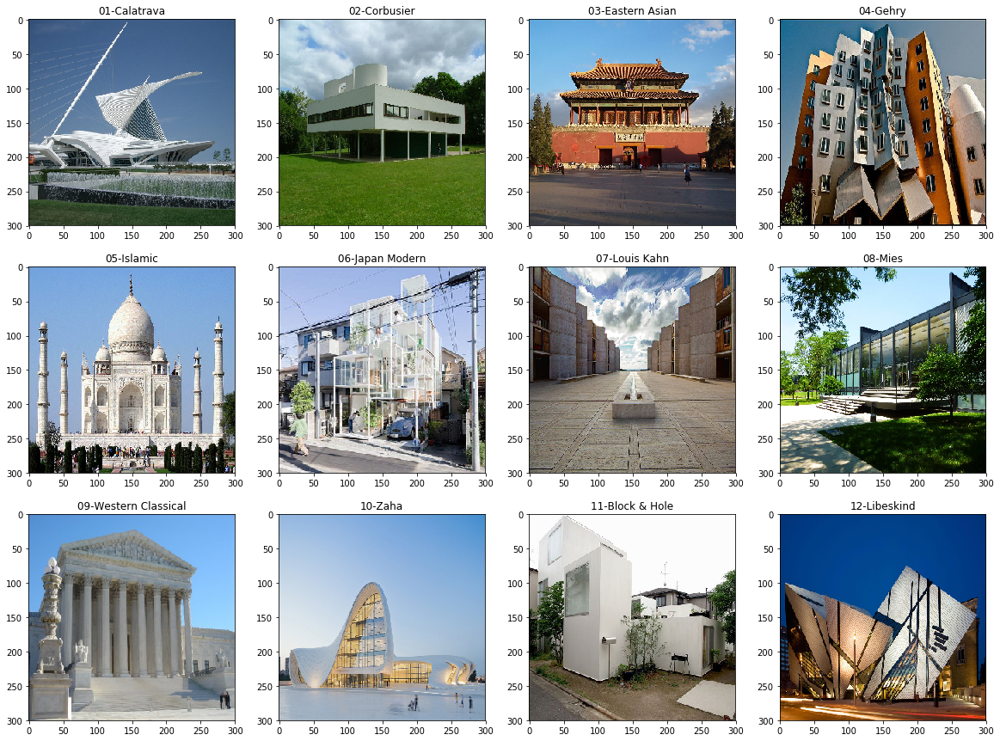

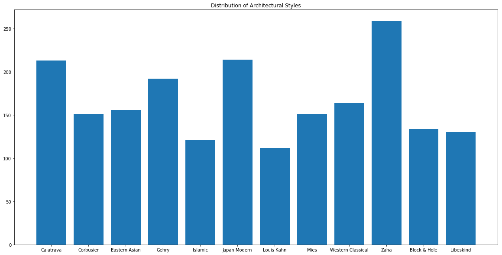

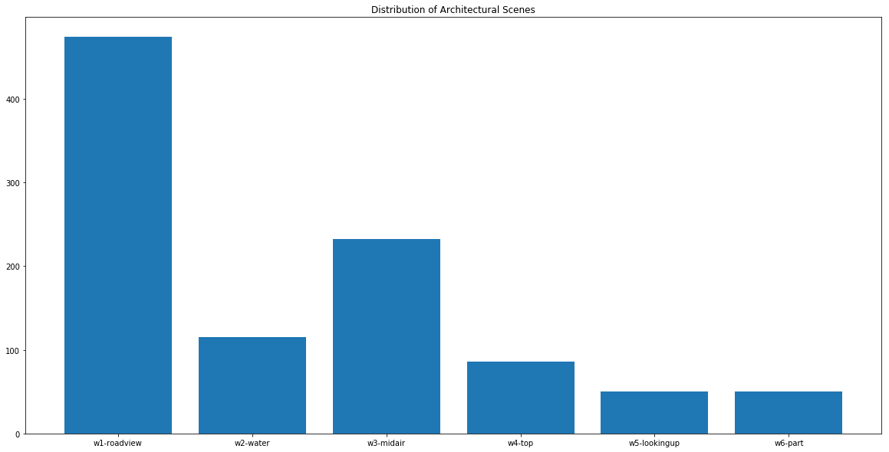
### Algorithms and Techniques

Identifying the scene of image may be relatively simple. I will try SVM. To recognize objects like people and cars, I will use YOLO system to detect the objects in the picture. To predict the architectural style, I will use CNN with transfer learning.

### Benchmark

The benchmark model is a simple convolutional neural network built by myself from scratch without transfer learning.
I used augmented arc_style train data to train the model 50 epochs with batch size of 8.

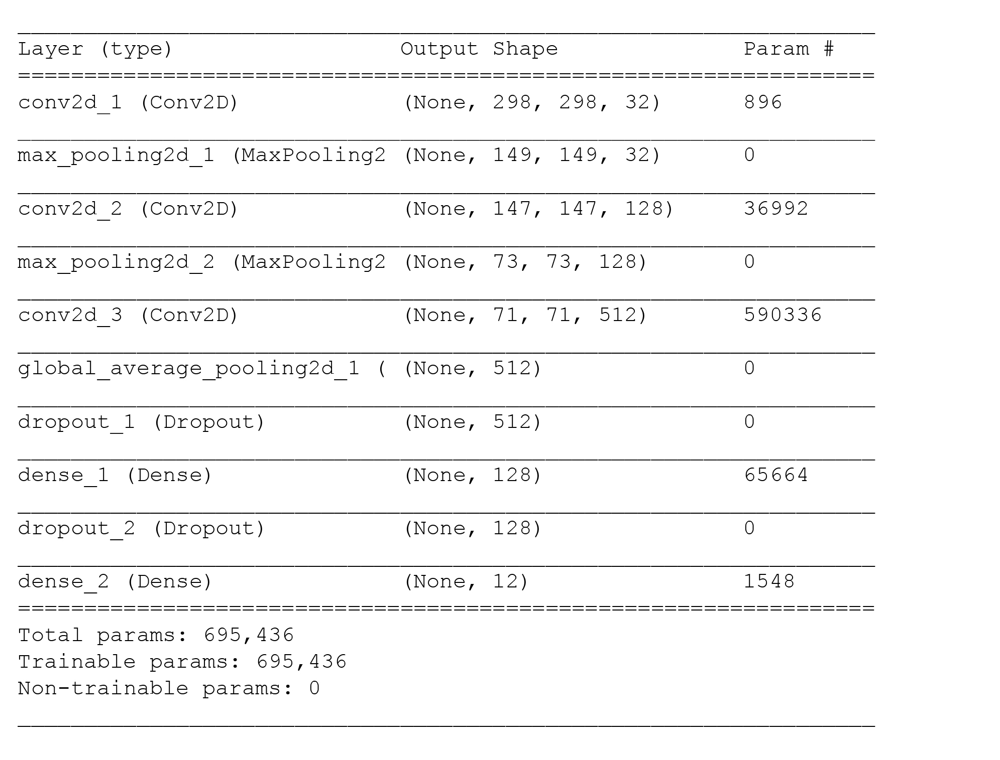

The result is:  
Test accuracy: 56.75%  
Confusion matrix:  
array([  
  [24,  0,  2,  0,  0,  6,  0,  0,  1,  5,  0,  1],  
       [ 1, 23,  1,  1,  0,  0,  1,  0,  0,  0,  2,  0],  
       [ 0,  0, 35,  0,  0,  0,  0,  1,  0,  0,  0,  0],  
       [ 6,  2,  7,  7,  3,  3,  0,  0,  0,  4,  4,  2],  
       [ 1,  0,  1,  1,  9,  2,  0,  0,  0,  2,  2,  0],  
       [ 2,  1,  4,  1,  0, 43,  0,  0,  1,  2,  6,  1],  
       [ 1,  1,  6,  0,  0,  3,  3,  0,  4,  1,  0,  0],  
       [ 4,  4,  0,  0,  0,  2,  0, 15,  1,  1,  1,  1],  
       [ 0,  0,  2,  0,  3,  3,  0,  0, 21,  0,  0,  0],  
       [ 8,  0,  3,  0,  0,  9,  0,  0,  2, 21,  2,  2],  
       [ 0,  3,  1,  0,  0,  2,  0,  1,  0,  1, 17,  2],  
       [ 4,  1,  1,  1,  2,  3,  1,  0,  1,  5,  0,  9]], dtype=int64)

From the confusion matrix, we can see some styles are more distinguishable than others. Some styles have quite subtle features that may be hard to tell, like Louis Kahn's works.

## III. Methodology

### Data Preprocessing

* Load the images and resize them as 300*300, the original images vary and are bigger than 300*300.
* Turn images files into 4D tensor.
* Split the data into test, train and validation sets.
* Create an `ImageDataGenerator` for data augmentation for the benchmark model.
* For the SVM algorithm to classify scenes, I implemented PCA to extract 40 principal components.

### Implementation
##### Architecture style classification
* Use the pre-trained VGG-19 model as a fixed feature extractor to get bottleneck features.
* Build a CNN model with one Flatten layer and two fully connected layers that takes the bottleneck features as inputs.
* Train the model with bottleneck features and save the best model weights.
* Load the best weights and test the model with test data.    

The initial model:
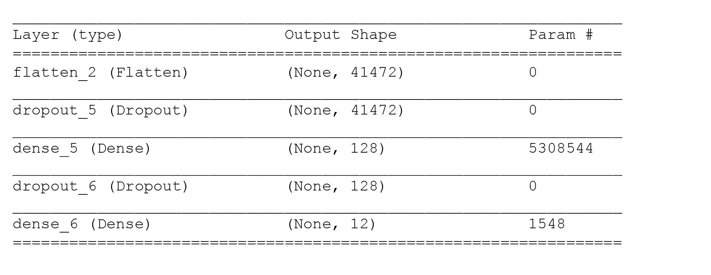  
Total params: 5,310,092  
Trainable params: 5,310,092  
Non-trainable params: 0  
Dropout: 0.3  
Epochs=60  
Batch_size=8  

The result:  
Test accuracy: 71.50%  
##### Architecture scene Classification
* Use 40 principal components as input and use train scene data set to train a SVM classifier to classify the scenes.   
* The final precision is 0.72.

##### Objects recognition
* Install darkflow and import the YOLO model and load its weights.
* Write an algorithm with OpenCV2 to draw the frame and label of objects detected by YOLO model. The image below is an example.
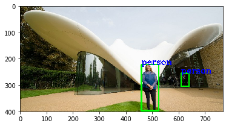

##### Write the algorithm for the Project
* Write an algorithm to combine the above 3 functions to analyze a picture.

### Refinement

The refinement will focus on the classification of architecture styles.
The initial solution has an accuracy of 71.50%.   
For the initial solution, the training/validation loss in the process of training shows that the model tends to overfit. I tried the following techniques to improve the model.  
* Change the Flatten layer to an GlobalAveragePooling2D layer to reduce the number of nodes to reduce the complexity of model.
* Adding dropout layers and adjust dropout parameters to reduce overfitting.
* Increase epochs and try different batch sizes.
* Change the number of fully-connected layers and filters.
* I tried different pre-trained models like VGG16 and ResNet50 to obtain bottleneck features, but the result is not as good as VGG19.

The final model has an accuracy of 78.00%.

## IV. Results

### Model Evaluation and Validation

The final model:  

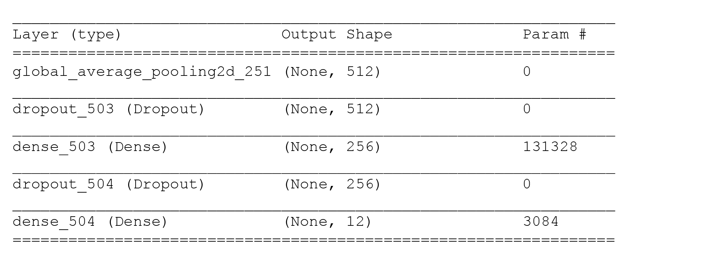
Input: bottleneck features from VGG19 model  
Total params: 134,412  
Trainable params: 134,412  
Non-trainable params: 0  
Dropout: 0.3  
Epochs: 60  
Batch size:16
optimizer: 'rmsprop'  

I test the model with unseen test data set of 400 images. The final result is:  
Test accuracy: 78.00%  
Confusion matrix (normalized):  
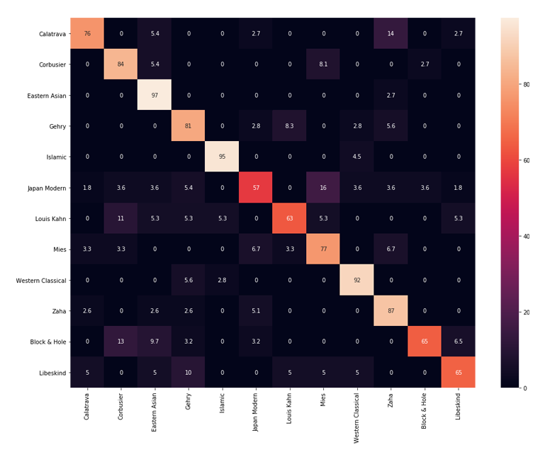  
* The trained using the pre-trained VGG19 model as a fixed feature extractor has a test accuracy rate of 78.00%.
* From the confusion matrix, we can see that the model can recognize traditional styles pretty well.
* The algorithm has difficulty recognize styles that are subtle like Japan Modern, Louis Kahn and Mies, which can also be similar to other styles.
* The styles that are often mistaken for each other by the algorithm are often similar styles, like Zaha and Calatrava, Corbusier and Kahn.

### Justification

* The final accuracy rate 78.00% is much better than the benchmark which is 56.75%.
* As architecture styles can be ambiguous and there are 12 styles to choose from, the final result is quite good. Sometimes when it classify a picture wrong, it can still give a result that is kind of close to its style.

## V. Conclusion

### Free-Form Visualization

I applied the algorithm to some pictures.  
The result:  

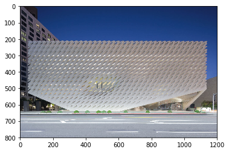   
Scene:  roadview  
Style:  Calatrava  

   
Scene:  roadview  
Style:  Mies  

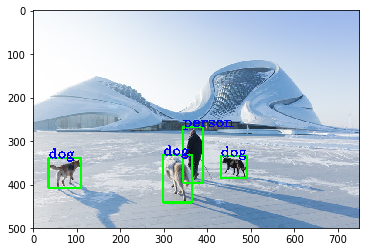  
Scene:  roadview  
Style:  Zaha

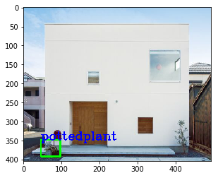    
Scene:  roadview  
Style:  Block & Hole

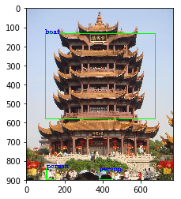    
Scene:  roadview  
Style:  Eastern Asian

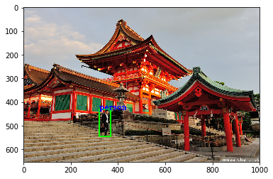     
Scene:  roadview  
Style:  Eastern Asian

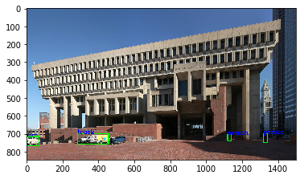      
Scene:  roadview  
Style:  Corbusier

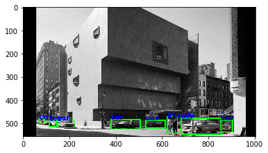      
Scene:  roadview  
Style:  Corbusier

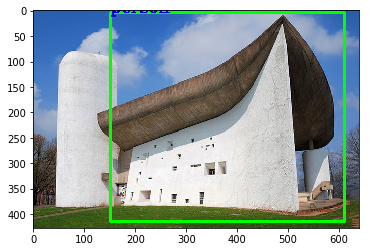      
Scene:  roadview  
Style:  Western Classical

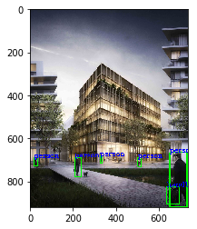      
Scene:  roadview  
Style:  Japan Modern

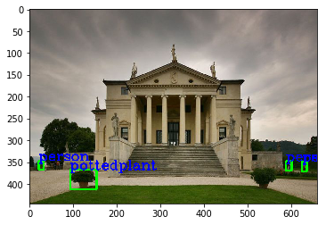       
Scene:  roadview  
Style:  Western Classical

_* Some classifications are wrong and some parts of some buildings are mistakenly recognized as objects._  
_* Some pictures are not exactly one of these styles but algorithm will give a style that is close._
### Reflection

The process for the project can be summarized as the following steps:

**Step 1: Import and preprocess the two datasets   
Step 2: Use SVM to classify scenes   
Step 3: Write an algorithm with YOLO system to find the objects in the picture  
Step 4: Create a CNN from scratch to classify architectural styles    
Step 5: Use transfer learning to create a CNN to classify architectural styles  
Step 6: Write an algorithm to analyze a picture of a building  
Step 7: Test the algorithm**

* Creating a new dataset is quite difficult and time-consuming and can influence the outcome of project a lot. Partly because the `arc_scene` dataset is not very developed, I didn't spend too much efforts on learning scenes.
* Step 4 and step 5, machine learning of architecture styles, are the most critical steps for the project. I tried many different configurations to get the final accuracy of 78%. I am quite satisfied with the outcome. Some buildings may be hard to judge even for people if the traits are not obvious.
* Since styles of modern architecture is not well defined, I classified some of them according to my knowledge. The result is quite interesting. From the confusion matrix, we can analyze the similarity between different styles as well as how distinguishable an architect's works are.

### Improvement

* The datasets are collected by myself in limited time and the classification of modern architecture doesn't have clear criterion. The dataset of arc_style has
about 2000 files, which may not be big enough for deep learning. To improve the
project, the dataset should be bigger with more rigorous classification standards.
* As it is not easy to classify building pictures, I researched about unsupervised deep learning which I hope it can cluster the pictures by itself. I haven't tried unsupervised deep learning yet.
* In my project, I first built a CNN and trained it with augmented data as benchmark. Then I used transfer learning with bottleneck features extracted from pre-trained VGG19 model. If I use the final solution as the new benchmark, I will try fine-tuning to further improve the result. I will import the convolutional base of VGG19 and load the weights, add fully-connected model on the top, freeze the layers of the VGG19 model up to the last convolutional block, and train the model the augmented data.

-----------
